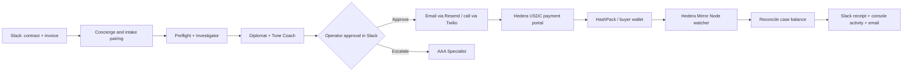

# Recoverly

Recoverly is an approval-first recovery workspace for Kenyan coffee and tea exporters managing overdue B2B invoices. It turns an invoice and contract into a structured case, prepares an appropriate collection action, keeps a human operator in control, and reconciles Hedera USDC settlement back to the case.

The primary demonstration flow is:

1. Upload a contract and invoice to the Recoverly Slack channel.
2. Pair the documents and extract the buyer, invoice, balance, due date, and governing-law context.
3. Run preflight, investigation, diplomacy, tone review, and escalation guidance.
4. Let an operator approve, revise, or reject an outbound collection action.
5. Send an approved email or place an approved call.
6. Give the buyer a case-specific Hedera Testnet USDC payment instruction with a `recoverly:CASE_ID` memo.
7. Watch the Hedera Mirror Node, match the transfer to the case, update the balance, and publish a receipt to Slack, the local console, and email.

> Recoverly is a prototype for controlled demonstrations. It is not legal advice, a production collections service, or an unattended enforcement tool. Outbound communication and payments must be configured deliberately and remain subject to operator approval.

## Features

- **Slack-first case intake** — contract and invoice uploads create and enrich a recovery case.
- **Document pairing and preflight** — reads PDFs, identifies key case facts, and routes work by balance and risk.
- **Specialized recovery roles** — Preflight, Investigator, Diplomat, Tone Coach, Voice Agent, Payment Agent, Escalator, and AAA Specialist contribute a focused step to the workflow.
- **Human-in-the-loop controls** — Slack cards provide approve, revise, reject, and escalation actions before a buyer is contacted.
- **Professional communications** — builds invoice reminders, demand-letter drafts, email messages, and call scripts.
- **Voice escalation** — uses Twilio for approved buyer calls and records the outcome in the case activity.
- **Hedera USDC settlement** — renders case-specific USDC instructions, monitors incoming transfers through a Hedera Mirror Node, reconciles the payment, and closes settled cases.
- **Local operator console** — shows case activity and agent progress at `/console`.
- **Auditable local state** — keeps case state, activity, payment ledger entries, and audit events locally for the prototype.

## Architecture



## Project structure

```text
recoverly/
├── src/
│   ├── webapp.py                # Flask app and registered routes
│   ├── config.py                # Environment-driven configuration
│   ├── agents/                  # Recovery-role adapters and case state
│   ├── concierge/               # Slack intake, cards, actions, email workflow
│   ├── preflight/               # PDF extraction, document pairing, risk routing
│   ├── diplomat/                # Collection-message templates and delivery
│   ├── investigator/            # Buyer-history and payment-pattern analysis
│   ├── aaa/                     # Arbitration / escalation guidance and letters
│   ├── voice/                   # Twilio call flow, transcripts, signals
│   ├── payments/                # Hedera client, USDC portal, watcher, reconciliation
│   └── local_console/           # Browser-based case activity console
├── web/                         # Payment portal template
├── config/                      # Reference configuration such as referrals
├── data/                        # Local runtime data; ignored by Git where appropriate
├── output/                      # Generated letters and documents
├── samples/                     # Sample intake material
├── tools/                       # Local simulation and configuration commands
├── tests/                       # Automated tests
├── .env.example                 # Safe environment-variable template
├── requirements.txt             # Python dependencies
└── README.md
```

## Technology

| Area | Technology | Purpose |
|---|---|---|
| Application | Python and Flask | Webhooks, payment portal, local console, and HTTP routes |
| Collaboration | Slack Events API, Block Kit, and interactive actions | Intake, operator approvals, and case notifications |
| AI workflow | OpenAI-compatible LLM provider | Drafting, analysis, tone review, and role-specific recommendations |
| Email | Resend | Approved collection notices and settlement receipts |
| Voice | Twilio | Approved buyer calls and call-status webhooks |
| Payments | Hedera Testnet, USDC, Hedera Mirror Node | Payment instructions, transfer observation, and reconciliation |
| Wallet | HashPack | Demo buyer wallet used to send USDC |
| Document handling | pypdf | Contract and invoice text extraction |
| Local exposure | ngrok | Public HTTPS URLs for local webhook demonstrations |
| Storage | JSON and JSONL files | Prototype case state, audit trail, and watcher state |

## Quick start

Use Python **3.11 or newer**.

```powershell
py -3.14 -m venv .venv
.venv/Scripts/python.exe -m pip install -r requirements.txt
Copy-Item .env.example .env
```

Update `.env` with credentials for only the services you plan to demonstrate. Do not commit `.env` or private keys.

Check the configuration and start the application:

```powershell
.venv/Scripts/python.exe -m tools.config_check
.venv/Scripts/python.exe -m src.webapp
```

The local server listens on `http://127.0.0.1:8400` by default.

| URL | Purpose |
|---|---|
| `/health` | Service health check |
| `/console` | Local multi-agent case console |
| `/pay/<case_id>` | Case-specific settlement portal |
| `/slack/events` | Slack Events API request URL |
| `/slack/interactivity` | Slack interactive action request URL |
| `/webhooks/resend` | Resend inbound/reply webhook |
| `/voice-webhook/twiml` | Twilio voice instructions |
| `/voice-webhook/call-status` | Twilio call-status webhook |

For Slack or Twilio callbacks during a local demo, expose port 8400 through ngrok and use the resulting HTTPS URL in the provider configuration.

## Hedera USDC payment flow

Recoverly's primary settlement path uses Hedera Testnet USDC.

1. The buyer opens `/pay/<case_id>`.
2. Recoverly provides the receiving account, USDC token, amount due, and exact memo: `recoverly:<case_id>`.
3. The buyer sends USDC from a wallet such as HashPack.
4. The watcher reads recent inbound token transfers from the configured Hedera Mirror Node.
5. `src/payments/wallet_poller.py` matches the memo to the case, deduplicates the transaction, and reconciles the amount.
6. Recoverly writes a receipt to Slack and the console, sends a settlement email, and closes the case when no balance remains.

Run the watcher in a second terminal after configuring Hedera settings:

```powershell
.venv/Scripts/python.exe -m src.payments.wallet_poller
```

The watcher is intentionally separate from the Flask server so its polling lifecycle can be managed independently.

Important variables include:

```text
HEDERA_NETWORK=testnet
HEDERA_RECEIVING_ACCOUNT_ID=0.0.xxxxx
HEDERA_USDC_TOKEN_ID=0.0.xxxxx
HEDERA_MIRROR_NODE=https://testnet.mirrornode.hedera.com
WALLET_POLL_INTERVAL_SEC=30
```

## Slack setup

Configure a Slack app with:

- Event request URL: `https://YOUR-PUBLIC-URL/slack/events`
- Interactivity request URL: `https://YOUR-PUBLIC-URL/slack/interactivity`
- Event subscriptions for messages and `file_shared`
- Scopes required for the configured workflow, including file access and chat posting
- A channel configured through `SLACK_CONCIERGE_CHANNEL`

The operator reviews all approve/revise/reject cards in that channel. Do not enable live communication paths until Slack request signing is configured.

## Running the role adapters

The prototype can run recovery roles as separate processes when the agent-runtime credentials are configured. Start only the roles needed for the workflow being demonstrated:

```powershell
.venv/Scripts/python.exe -m src.agents.preflight_agent
.venv/Scripts/python.exe -m src.agents.investigator_agent
.venv/Scripts/python.exe -m src.agents.diplomat_agent
.venv/Scripts/python.exe -m src.agents.tone_coach_agent
.venv/Scripts/python.exe -m src.agents.concierge_agent
.venv/Scripts/python.exe -m src.agents.payment_agent
.venv/Scripts/python.exe -m src.agents.voice_agent
.venv/Scripts/python.exe -m src.agents.escalator_agent
.venv/Scripts/python.exe -m src.agents.aaa_specialist_agent
```

## Local data model

This prototype deliberately uses files instead of a hosted database:

```text
data/
├── case_state/                 # Per-case JSON state
├── local_console/sessions.json # Console sessions and activity
├── audit_trail.jsonl           # Append-only audit events
├── wallet_poller_state.json    # Hedera watcher cursor and deduplication state
├── processed_transactions.json # Applied transaction identifiers
└── wallet_case_ledger.json     # Wallet-to-case associations
```

For production, these records should move to a transactional database such as PostgreSQL, with authenticated users, durable background jobs, encrypted secrets, and a formal audit-retention policy.

## Testing

Run the automated test suite:

```powershell
.venv/Scripts/python.exe -m pytest -q
.venv/Scripts/ruff.exe check src tests --select E9,F63,F7,F82
.venv/Scripts/python.exe -m pip check
```

Tests use isolated temporary data and test doubles for external services. They do not send real emails, make live calls, or move funds.

## Security and operational notes

- Keep `.env`, Hedera private keys, Slack tokens, Twilio credentials, and Resend API keys out of Git.
- Use provider test credentials and controlled recipients for demos.
- Keep Slack, Resend, and Twilio signature verification enabled outside a deliberately isolated local demo.
- A payment is considered settled only after the watcher observes and reconciles the Hedera transaction.
- Review all AI-generated wording and escalation actions before sending them to a buyer.

## License

No license has been selected yet. Add an open-source license before public distribution.
